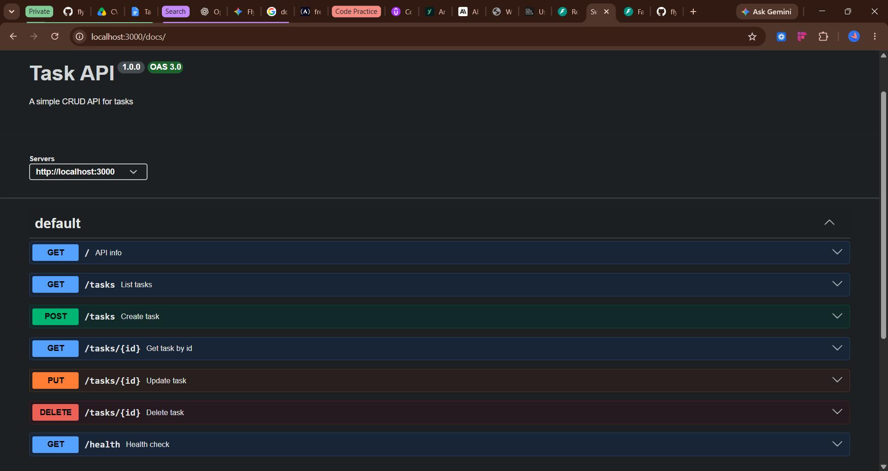

# Week 2 Assignment — Express CRUD API (JavaScript Track)

This directory contains the Node.js / Express implementation of the Week 2 CRUD API assignment.

---

## 🛠️ Stack & Prerequisites

- **Runtime:** Node.js `>= 20.0.0`
- **Framework:** Express.js (`v5`)
- **Package Manager:** `pnpm`

---

## 🚀 Installation & Running

1. **Navigate to this folder:**
   ```bash
   cd backend-ai-engineering/w2-a1-build-your-first-CRUD-API/js-track
   ```
2. **Install dependencies:**
   ```bash
   pnpm install
   ```
3. **Start the development server:**

```bash
pnpm start
```

4. **Verify the server:**
   - Open http://localhost:3000 in your browser or
   - Postman

---

## 📡 API Endpoints

### Summary

| Method | Endpoint | Description                                             |
| ------ | -------- | ------------------------------------------------------- |
| GET    | /        | Returns metadata about the API.                         |
| GET    | /docs    | Swagger UI documentation (served by swagger-ui-express) |
| GET    | /tasks   | Returns a list of all tasks                             |
| POST   | /tasks   | Create a new task (JSON body: `{ "title": "..." }`) |
| GET    | /tasks/:id | Retrieve a task by `id`                               |
| PUT    | /tasks/:id | Update a task by `id` (JSON body: `title` and/or `done`) |
| DELETE | /tasks/:id | Delete a task by `id`                                 |
| GET    | /health  | Returns a JSON object indicating the server is healthy. |

---

## 📘 Swagger UI

After installing dependencies, start the server and open the documentation at:

- http://localhost:3000/docs


